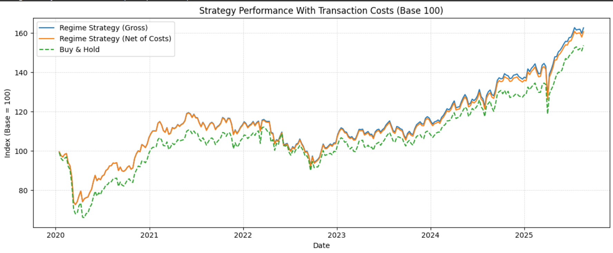

\# Geopolitical Risk–Adjusted Regime Strategy

\*\*Idea.\*\* Combine Google-Trends geopolitical risk proxy with market volatility (VIX/OVX/TLT/DXY + EM/oil vol) to classify Calm/Neutral/Stress regimes and allocate ETFs.

\*\*Run\*\*

\- Open `01_georisk_regime.ipynb`

\*\*Colab\*\*

\[!\[Open In Colab](https://colab.research.google.com/assets/colab-badge.svg)](https://colab.research.google.com/github/<your-username>/quant-portfolio/blob/main/projects/01\_georisk\_regime/notebook.ipynb)

