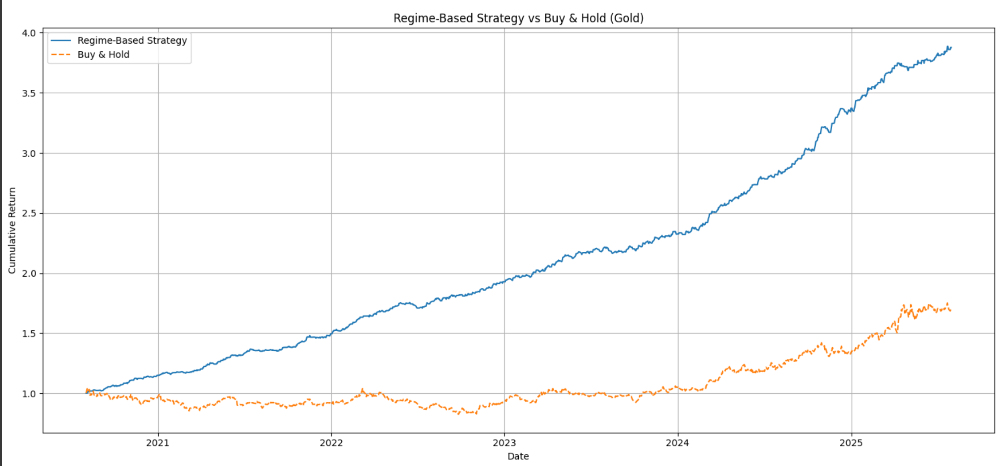

\# Regime-Switching Volatility in Gold (HMM)

\*\*Idea.\*\* Fit a 2-state Gaussian HMM to gold log returns, label regimes (low/high vol), compare regime-aware vs buy-and-hold.

## Strategy Performance

