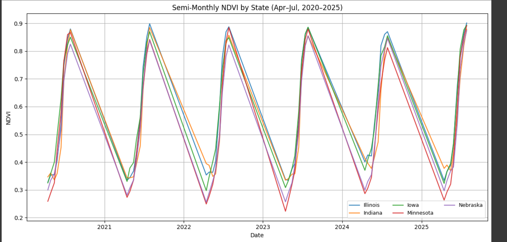

\# Satellite-Based Alternative Alpha (NDVI → Corn Futures)

\*\*Idea.\*\* Use Sentinel-2 NDVI across 15 corn regions to engineer crop-growth features and build predictive signals for corn futures.

## NDVI Features by State

