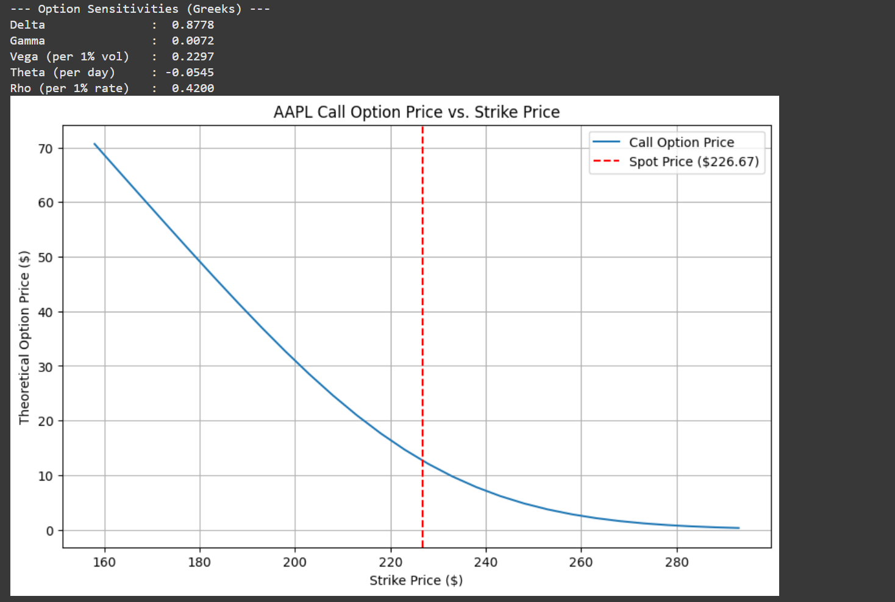

\# Options Pricing \& Hedging Tool

\*\*Features\*\*

\- Black–Scholes \& Monte Carlo pricers

\- Greeks (Δ, Γ, Vega, Theta, Rho)

\- Implied volatility solver

\- Price-vs-strike plots

\- Delta-hedging toy backtest

## Example Output

